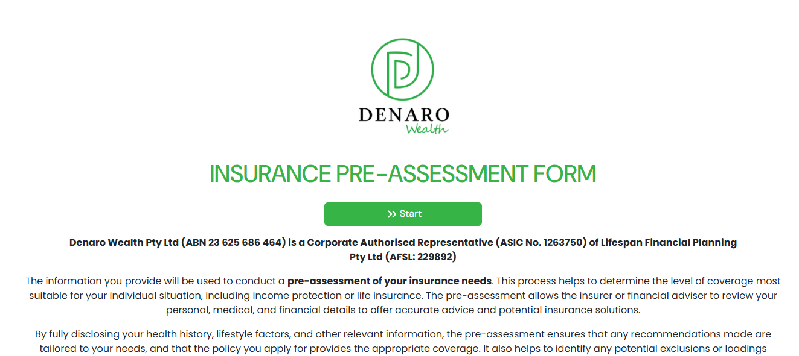

# Adviser Assess Frontend

This project is a React-based web application built with Vite, designed for adviser assessment workflows.  
It provides a modern, fast, and user-friendly interface for collecting, managing, and reporting client information.

## Project Screenshot



_Above: Example interface of the Adviser Assess Frontend application._

## Features

- **Dynamic Question Sets:** Interactive forms for health, medical, income, and other personal information.
- **Conditional Rendering:** Fields and sections appear based on user responses.
- **Multi-select Inputs:** Easily select multiple options for structured data.
- **Custom Components:** Includes reusable components for inputs, cards, and dynamic blocks.
- **Ant Design Integration:** Uses Ant Design for modals, notifications, and UI consistency.
- **Formik Integration:** Robust form state management and validation.
- **Real-time Formatting:** Automatic formatting for currency and numeric fields.
- **Report Generation:** System generates assessment reports based on user input.
- **Email Reports:** Automatically sends generated reports to specified email addresses.
- **Responsive Design:** Optimized for desktop and mobile devices.
- **ESLint & Code Quality:** Enforced coding standards and best practices.
- **Fast Refresh:** Instant updates during development with Vite HMR.

## Tools & Technologies

- **React** (with hooks)
- **Vite** (for fast development and build)
- **Ant Design** (UI library)
- **Formik** (form management)
- **Yup** (validation)
- **ESLint** (linting)
- **React Icons** (icon library)
- **Custom Components** (for modularity and reusability)

## Getting Started

1. **Install dependencies:**
   ```
   npm install
   ```
2. **Run the development server:**
   ```
   npm run dev
   ```
3. **Build for production:**
   ```
   npm run build
   ```

## Functionality Overview

- Users fill out dynamic forms for various assessment categories.
- The system validates and formats input data in real time.
- Upon completion, a report is generated and sent via email.
- Admins and advisers can review submitted data and reports.

## License

MIT

---

For more details, see the source code and documentation.
