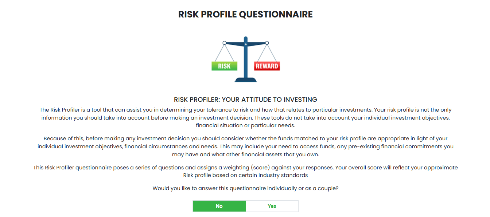

# Risk Profile Frontend

This project is a React-based web application built with Vite, designed to streamline the risk profiling process for advisers and clients.  
It offers a fast, modern, and intuitive interface for collecting, managing, and reporting risk profile information.

## Project Screenshot



## Features

- **Dynamic Questionnaires:** Interactive forms for risk assessment, including client and partner profiles.
- **Conditional Logic:** Fields and sections adapt based on user responses.
- **Multi-step Navigation:** Guided step-by-step process for completing the risk profile.
- **Reusable Components:** Modular components for inputs, cards, and dynamic blocks.
- **Ant Design Integration:** Consistent UI with modals, notifications, and form elements.
- **Formik & Yup:** Robust form state management and validation.
- **Real-time Formatting:** Automatic formatting for numeric and currency fields.
- **Report Generation:** Generates risk profile reports based on user input.
- **Email Integration:** Option to send reports via email.
- **Responsive Design:** Optimized for both desktop and mobile devices.
- **Code Quality:** Enforced standards with ESLint and best practices.
- **Fast Refresh:** Instant updates during development with Vite HMR.

## Tools & Technologies

- **React** (hooks-based)
- **Vite** (fast development/build)
- **Ant Design** (UI library)
- **Formik** (form management)
- **Yup** (validation)
- **ESLint** (linting)
- **React Icons** (icon library)
- **Custom Components** (for modularity)

## Getting Started

1. **Install dependencies:**
   ```
   npm install
   ```
2. **Run the development server:**
   ```
   npm run dev
   ```
3. **Build for production:**
   ```
   npm run build
   ```

## Functionality Overview

- Users complete a multi-step risk profile form.
- The system validates and formats input data in real time.
- Upon completion, a risk profile report is generated and can be sent via email.
- Advisers can review submitted profiles and reports.

## License

MIT

---

For more details, see the source code and documentation.
